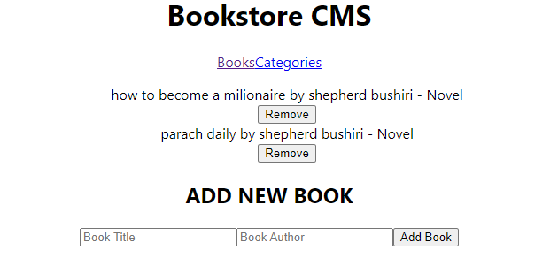

# app-bookstore

> A web app for adding, removing and editing books.




## Built With

- HTML
- CSS
- JAVASCRIPT
- React

## Live Demo (if available)
[Live Demo Link](http://localhost:3000/)


## Getting Started


To get a local copy up and running follow these simple example steps.

### Prerequisites

- Web browser
- Code editor

### Setup


```bash
npm install
```

```bash
npm build
```

```bash
npm start
```

### Run the following commands to run linter tests


StyleLint
```bash
npx stylelint "**/*.{css,scss}"
```

ESLint
```bash
npx eslint .
```


## Authors

👤 **Author1**
👤 **Tamara Siansanda**

- GitHub: [@SiansandaTamara](https://github.com/SiansandaTamara)
- Twitter: [@twitterhandle](https://twitter.com/TamaraSiansanda)


## Show your support

Give a ⭐️ if you like this project!

## Acknowledgments

- Hat tip to anyone whose code was used

## 📝 License

This project is [MIT](https://github.com/SiansandaTamara/app-bookstore/blob/dev/LICENSE) licensed.

## 🤝 Contributing

Contributions, issues, and feature requests are welcome!


